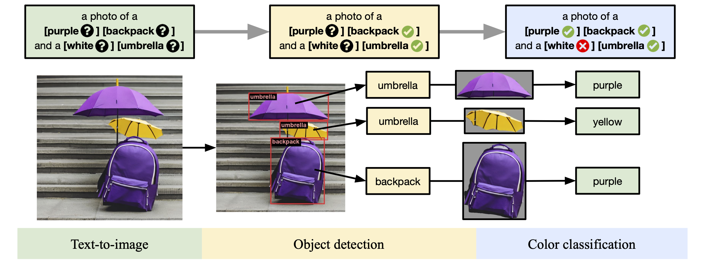

# GenEval: An Object-Focused Framework for Evaluating Text-to-Image Alignment

This repository contains code for the paper [GenEval: An Object-Focused Framework for Evaluating Text-to-Image Alignment](https://arxiv.org/abs/2310.11513) by Dhruba Ghosh, Hanna Hajishirzi, and Ludwig Schmidt.

TLDR: We demonstrate the advantages of evaluating text-to-image models using existing object detection methods, to produce a fine-grained instance-level analysis of compositional capabilities.

### Abstract
*Recent breakthroughs in diffusion models, multimodal pretraining, and efficient finetuning have led to an explosion of text-to-image generative models.
Given human evaluation is expensive and difficult to scale, automated methods are critical for evaluating the increasingly large number of new models.
However, most current automated evaluation metrics like FID or CLIPScore only offer a holistic measure of image quality or image-text alignment, and are unsuited for fine-grained or instance-level analysis.
In this paper, we introduce GenEval, an object-focused framework to evaluate compositional image properties such as object co-occurrence, position, count, and color.
We show that current object detection models can be leveraged to evaluate text-to-image models on a variety of generation tasks with strong human agreement, and that other discriminative vision models can be linked to this pipeline to further verify properties like object color.
We then evaluate several open-source text-to-image models and analyze their relative generative capabilities on our benchmark.
We find that recent models demonstrate significant improvement on these tasks, though they are still lacking in complex capabilities such as spatial relations and attribute binding.
Finally, we demonstrate how GenEval might be used to help discover existing failure modes, in order to inform development of the next generation of text-to-image models.*

### Summary figure

    

### Main results

| Model | Overall | Single object | Two object | Counting | Colors | Position | Color attribution |
| ----- | :-----: | :-----: | :-----: | :-----: | :-----: | :-----: | :-----: |
| CLIP retrieval (baseline) | **0.35** | 0.89 | 0.22 | 0.37 | 0.62 | 0.03 | 0.00 |
minDALL-E | **0.23** | 0.73 | 0.11 | 0.12 | 0.37 | 0.02 | 0.01 |
Stable Diffusion v1.5 | **0.43** | 0.97 | 0.38 | 0.35 | 0.76 | 0.04 | 0.06 |
Stable Diffusion v2.1 | **0.50** | 0.98 | 0.51 | 0.44 | 0.85 | 0.07 | 0.17 |
Stable Diffusion XL | **0.55** | 0.98 | 0.74 | 0.39 | 0.85 | 0.15 | 0.23 |
IF-XL | **0.61** | 0.97 | 0.74 | 0.66 | 0.81 | 0.13 | 0.35 |

## Code

(Coming soon)
